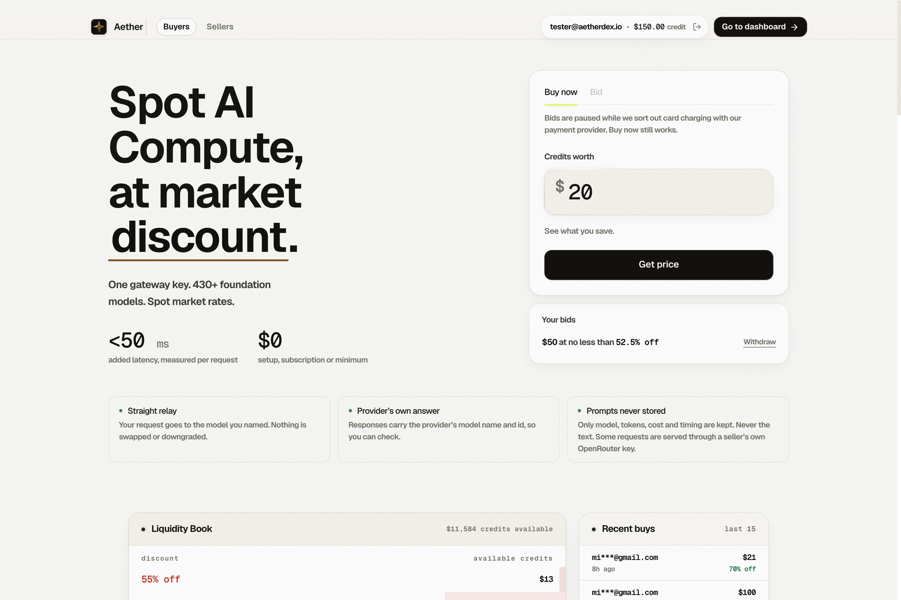

# Aether DEX

> **Decentralized Spot AI Compute & Inference Credit Trading Platform**

[](LICENSE)
[](#)
[](https://x.com/aetherdex)

Aether is a decentralized marketplace for trading spot AI inference compute and credit allocations below list price. Featuring an automated liquidity order book, one-stop gateway key integration, key monetization for compute sellers, and a revenue-sharing dividend protocol for `$AETHER` holders.

---

## 📸 Overview



---

## ✨ Key Features

- **Spot Market Discount**: Purchase foundation model inference credit at deep market discounts with real-time liquidity book pricing.
- **Universal Gateway Key**: One API key compatible with any OpenAI or Anthropic SDK, routing across 430+ foundation models with <50ms added latency.
- **Key Staking & Monetization**: Sellers can list idle API keys, set floor discounts, and get paid automatically in USDG as requests are filled.
- **Holder Dividends**: 50% of platform fees are converted into inference credits and distributed to `$AETHER` token holders every hour.
- **Model Context Protocol (MCP)**: Native MCP integration allowing AI agents (Claude Code, Codex) to autonomously monitor balances and top up keys.

---

## 🚀 Quick Start

Launch the local server using Python or Node.js:

```bash
# Option 1: Run directly with Python (Recommended - native route simulation & image decoding)
python3 serve.py 3001

# Option 2: Run with package manager
pnpm start
# or
npm start
```

Open your browser and navigate to: **http://localhost:3001**

---

## 🌐 Routes & Pages

| Route | Description |
| :--- | :--- |
| **`/`** | **Buyers Home** — Live model discount book, liquidity depth, recent purchases, integration guide, and FAQ |
| **`/account`** | **Buyer Portal** — Manage gateway API keys, view 30-day spend analytics, and monitor token usage |
| **`/sell`** | **Sellers Landing** — Overview of listing idle API keys and monetizing excess compute |
| **`/supply`** | **Key Management** — List keys, set discount floors, view fill rates, and claim earnings |
| **`/dashboard`** | **Holder Dashboard** — Track earned credits, claimable USDG balance, and active Aether keys |
| **`/holders`** | **Holders Guide** — Tokenomics breakdown and fee distribution mechanism for `$AETHER` holders |
| **`/points`** | **Rewards & Points** — Season 1 points progression, tier multipliers, and earning rules |
| **`/leaderboard`** | **Leaderboard** — Top liquidity suppliers, traders, and points ranking |
| **`/mcp`** | **MCP Integration** — Protocol documentation, configuration snippets, and CLI setup guides |
| **`/jobs`** | **Task Queue** — Background compute verification and node task registry |

---

## 📁 Project Structure

```
aether-token-exchange/
├── screenshots/             # Interface previews & documentation assets
│   └── homepage.png         # High-resolution homepage preview
├── pages/                   # Standalone HTML routes
│   ├── index.html           # Buyer marketplace
│   ├── account.html         # Account analytics & keys
│   ├── sell.html            # Seller landing
│   ├── supply.html          # Seller supply & claims
│   ├── dashboard.html       # Holder dashboard
│   ├── holders.html         # Token distribution
│   ├── points.html          # Points system
│   ├── jobs.html            # Background worker queue
│   ├── leaderboard.html     # Leaderboard rankings
│   └── mcp.html             # MCP protocol documentation
├── _next/                   # Next.js static engine
│   └── static/immutable/
│       ├── chunks/          # Compiled client bundles & Tailwind CSS
│       └── media/           # Web fonts (Geist, DM Sans) and 3D assets
├── public/                  # Static assets (Favicons, 3D stars, OG graphics)
├── wallets/                 # Web3 wallet icons (MetaMask, Coinbase, Rabby)
├── serve.py                 # Multi-route local HTTP server & image proxy
├── package.json             # Project metadata & npm run scripts
└── README.md                # Project documentation
```

---

## 🛠 Technical Architecture

1. **Unified Single-Domain Routing**: Aggregates both buyer and seller ecosystems under a single clean routing layer without cross-domain redirects.
2. **Next.js Image Proxy**: `serve.py` emulates `/_next/image` optimization endpoints, serving retina-ready assets with proper MIME types.
3. **Fully Offline & Self-Contained**: All fonts, JS bundles, icons, and 3D media assets are stored locally for fast, zero-dependency development.

---

## 📬 Contact & Community

- **X (Twitter)**: [@aetherdex](https://x.com/aetherdex)
- **Email**: [contact@aetherdex.io](mailto:contact@aetherdex.io)
